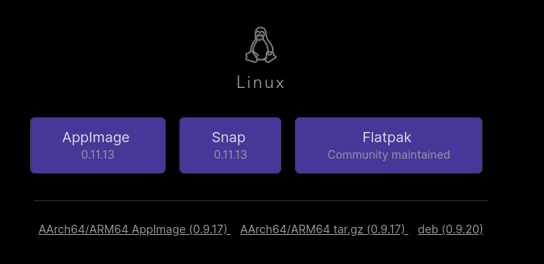

# Instalación

Obsidian es multiplataforma por lo tanto puedes tenerlo tanto en Windows Linux o Mac según el sistema operativo que uses para ello puedes realizar los siguientes pasos para instalarlo.


Obsidian solo esta disponible en 32 Bits para Windows.

Descarga la ultima versión: [https://obsidian.md/download](https://obsidian.md/download)




En Windows requieres solo descargar el instalador desde:



Descargas el .exe, en caso de que no estes seguro de cual realizar la descarga, puedes dirigirte al portal de Obsidian [https://obsidian.md](https://obsidian.md) y lo primero que tendras es un boton para bajar la ultima versión.



Para los usuarios de Linux se cuenta con la opción de instalar por medio de [Flatpak](https://flathub.org/apps/details/md.obsidian.Obsidian) o [Snap](https://github.com/obsidianmd/obsidian-releases/releases/) además de contar tanto la compilación desde las fuentes como tambien el paquete deb para usuarios basados en Debian.




Para la instalación de Mac se encuentra disponible en


[https://obsidian.md/download](https://obsidian.md/download)




## Obsidian para dispositivos Móviles

Actualmente Obsidian se encuentra desarrollando la versión Mobile tanto para Android como para Iphone, se encuentra en una fase de testeo conocida como Beta.

Puedes ver más información sobre esto en [**Obsidian - Mobile app Beta** ](https://help.obsidian.md/Mobile+app+beta)\*\*\*\*


Cuando se tenga disponible la aplicación para dispositivos móviles se actualizará esta página.


